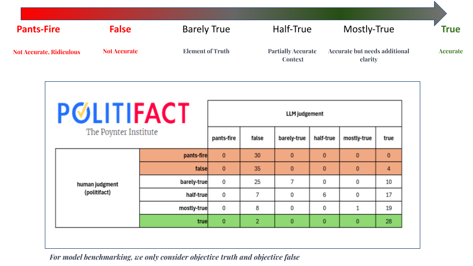
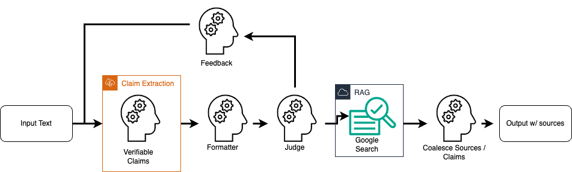

## Dataset

To ensure Verif.AI's accuracy, we evaluate our model using [Politifact's](https://www.politifact.com/) dataset as a benchmark for several reasons. First, it focuses on verifying current political facts, a prevalent topic on social media and prone to misinformation. Second, PolitiFact's ongoing updates ensure we test against the most recent ground truths, avoiding biases from outdated information. This focus on high-quality, recent data allows us to rigorously evaluate our model's performance in the dynamic political landscape.

## Model Pipeline

When you enter a claim into our browser extension, it triggers our backend model pipeline. The statement undergoes rigorous validation through a series of checks and functions designed to assess its accuracy.

One of the biggest challenges with large language models is their tendency to "hallucinate" – generating false justifications or inventing facts. To address this, Verif.AI utilizes two innovative techniques: LLM-based multi-agent collaboration and Retrieval-Augmented Generation (RAG).

### LLM Agents

Although LLMs are trained on massive datasets from various domains, models can still make mistakes and output irrelevant or even incorrect facts. To combat this, our model utilizes a multi-agent verification system. Imagine it as a team of experts - each LLM agent with its own strengths and knowledge base. They collaborate to assess a claim, ensuring a more robust and accurate evaluation.

Our LLM agents prioritize analyzing claims that require verification. They can efficiently distinguish between established facts (like "the sky is blue") and potentially disputed ones (like "vaccines cause harm"). For disputable claims, agents analyze the complexity and compare it to the knowledge of the other agents. This prioritization ensures Verif.AI focuses its resources on combating misinformation where it matters most.

### RAG

Once our LLM agents determine a claim's check-worthiness, Verif.AI employs a powerful technique called Retrieval-Augmented Generation (RAG).  Think of RAG as a digital librarian, scouring the web for relevant and reliable sources to substantiate the claim.  By analyzing both the claim itself and the retrieved information, RAG can provide a more comprehensive picture. This empowers you to not only understand the truthfulness of the claim but also explore the reasoning and evidence behind it.

### Results

Our evaluation focused on measuring how effectively Verif.AI distinguishes between true and false claims, particularly within the political sphere. We compared our model's performance against baseline LLMs that processed claims through our pipeline but lacked the Retrieval-Augmented Generation (RAG) search functionality.

| Description | LLM        | F1 Score | Sensitivity (Correctly judge false) | Specificity (Crrectly judge true) | Time          |
| ----------- | ---------- | -------- | -------------------------------------- | ------------------------------------ |               |
| No RAG      | LLAMA-2    | 0.55     | 0.39                                   | 0.96                                 |               | 
| No RAG      | Mistral-7b | 0.84     | 0.87                                   | 0.50                                 |               |
| RAG         | Mistral-7b | 0.96     | 0.94                                   | 0.93                                 |               |
| Human       | -          | >0.99    | >0.99                                  | >0.99                                | Days to Weeks | 

We utilized three key metrics: F1 score, sensitivity, and specificity.

- F1 Score: This metric provides a balanced view of both precision (correctly identifying false claims) and recall (not missing any false claims). It allows us to fine-tune our model for optimal performance.
- Sensitivity: This metric assesses the model's ability to correctly identify false claims (true positives).
- Specificity: This metric assesses the model's ability to correctly identify true claims (true negatives).

Our model achieved a higher F1 score compared to the baseline LLMs, demonstrating its superior ability to classify false articles from the PolitiFact dataset. Additionally, Verif.AI exhibited a high accuracy rate in correctly judging false claims as false (high sensitivity).

#### Humans vs Machine

While human subject-matter experts will always hold an edge in accuracy given sufficient time, Verif.AI offers a significant advantage in terms of speed.  While human experts might require days or weeks to analyze information, Verif.AI can deliver reliable judgments within seconds. This real-time capability empowers users to make informed decisions quickly and efficiently.

These results highlight the effectiveness of Verif.AI's approach in combating misinformation. By combining multi-agent verification with RAG technology, Verif.AI delivers a powerful and accurate fact-checking solution.

## Key Learnings

Verif.AI prioritizes building accessible and reliable fact-checking tools. Here's what we learned during development and modeling stage.

1. **Streamlined Efficiency**
    We adopted a Lang-graph based model pipeline by incoporating the state-of-the-art LLMs with scalable cloud computation with AWS to efficiently handle requests at scale. This translates to faster and more accurate justifications and sources fo rusers.

2. **Reliablility**
    Our model boasts over 90% sensitivity rate in detecting false headlines within the political domain. This ensures that you are confident in detecting trustworthy claims from information online with our tool.

3. **Enhanced Information**
    Beyond simple "true" or "false" labels,  our browser extension provides users with detailed search results relevant to the claim. This empowers users to understand the claim in depth and look into search results relevant to their problem.

4. **Innovation**
    Verif.AI stands out from its competitors by offering a user-friendly browser extension that leverages our public API. We've also benchmarked our system against state-of-the-art LLMS, demonstrating its effectiveness in combating misinformation

## Obstacles & Opportunities

Although we've made leaps and bounds to create an amazing product, we still encounter certain chalenges.

Ensuring accurate and unbiased outputs from the LLM requires continuous work. This includes preventing hallucinations and refining the format of the LLM's response for seamless integration into the user interface. Additionally, limited API access to search engines like Google can affect the comprehensivenss of our analysis.

Despite these obstacles, we're driven by the opportunities to improve and enhance our product. By fine-tuning our LLM, we can further improve the precision and comprehensiveness of our fact-checking capabilities. Coupled with assessing a wider range of LLMs, we can unearth interesting discoveries that may allow our model to decrease model drift in a rapidly growing and changing field of social media. Refining our sources or even utilizing different sources can allow us to prioritize trustworhty information and minimize the influence of unreliable websites.
